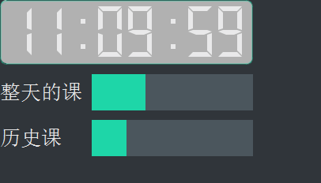

# 网课进度条 - online class process bar
网课有亿点无聊好吧

这时候弄个进度条不就好了？

实时提示这节课/一天的课上到多少了

支持丰富的qss样式定义！

## 特点
- 可以带一个时钟
- 多个进度条同时运行
- 事件开始自动显示进度条，事件结束自动隐藏进度条
- 悬浮球，可以拖动
- 超级丰富的可自定义度！！！啥都能通过JSON自定义

## 图片

## 使用方法
1. 下载/clone储存库
2. 执行命令：*直接从release下载的话，不用执行*
```bash
pip install -r requirements.txt
```
3. 根据自己的喜好配置`settings.json`
4. 运行main.py或main.exe！

## settings.json配置
| 键               | 值                          | 默认值         |
| ---------------- | --------------------------- | -------------- |
| clock            | 是否显示时钟                | `true`         |
| update_frequency | 进度条更新频率（毫秒）      | 500            |
| qss_window       | 窗口样式qss                 | 带绿色的进度条 |
| qt_material      | `Qt_material`用到的.xml样式 | dark_teal.xml  |
| processes        | 进度条（列表/array）        | 无             |

`Qt_material`设置见[文档](https://qt-material.readthedocs.io/en/latest/index.html)或[github](https://github.com/UN-GCPDS/qt-material)

## `processes`进度条配置
array的每一项是dict，其配置如下：
| 键      | 值                           | 默认值     |
| ------- | ---------------------------- | ---------- |
| text    | 唯一的标识                   | 无         |
| start   | 这个事件开始时间             | 无         |
| end     | 这个事件结束时间             | 无         |
| label   | 显示在屏幕上的字             | 与text相同 |
| ndigits | 精确的位数（好像没什么卵用） | 4          |

`start`、`end`必须是ISO格式的日期，如`01:05:24`或`01:05`，秒数可以没有，但是时分必须是两位，要自己补0

## 一个配置的例子
```json
{
    "clock": true,
    "update_frequency": 500,
    "processes": [
        {
            "name": "整天的课",
            "start": "07:10:00",
            "end": "18:45:00",
            "ndigits": 4
        },
        {
            "name": "历史",
            "start": "11:00:00",
            "end": "11:45:00",
            "label": "历史课"
        },
        {
            "name": "课间",
            "start": "10:45:00",
            "end": "11:00:00"
        }
    ]
}
```
